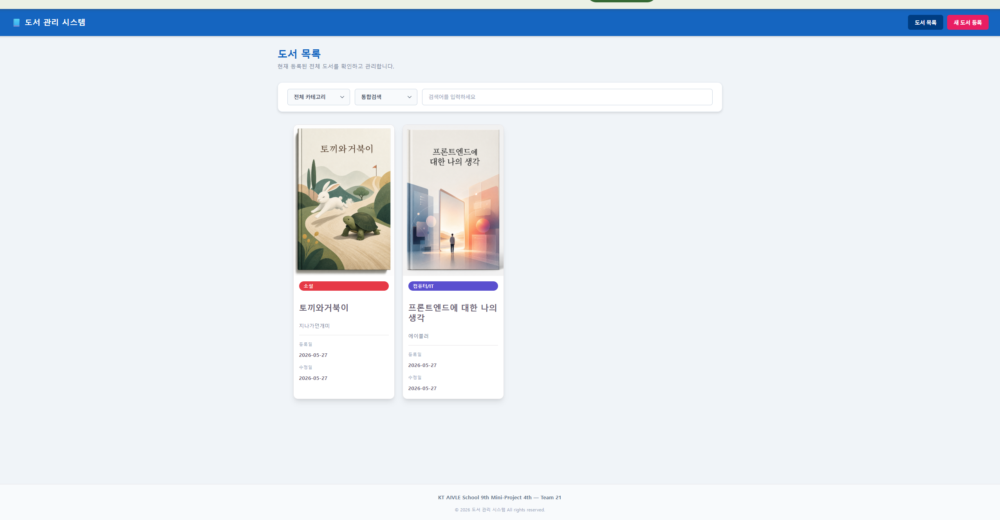
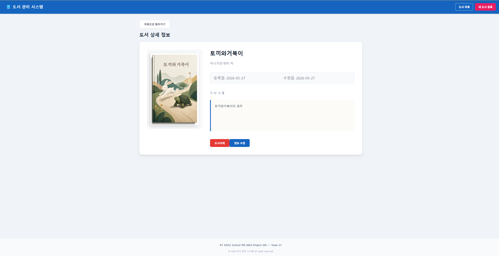

# 📚 AI 기반 감성 창작 도서 관리 시스템 (Team 21)

> **KT AIVLE School 9th Mini-Project 4th**  
> 본 프로젝트는 사용자가 작성한 글의 제목과 본문 내용을 분석하여  
> OpenAI GPT Image 모델을 통해 세상에 단 하나뿐인 감성 도서 표지를 자동 생성하는 스마트 창작 플랫폼입니다.  
> 또한 `json-server` 기반 가상 REST API 서버를 활용하여 도서 데이터의 조회, 생성, 수정, 삭제(CRUD) 및 AI 연동 기능을 제공합니다.

---

# 🛠 Tech Stack

- React
- Vite
- JavaScript (ES6+)
- CSS3
- json-server
- OpenAI API

---

# ✨ Key Features

- 📖 도서 CRUD 기능 구현
- 🎨 OpenAI 기반 AI 표지 자동 생성
- ⚡ 비동기 상태(State) 실시간 동기화
- 🔐 API Key 보안 처리 (`type="password"`)
- 🚨 예외 처리 UX 구성 (401 / 429 / 서버 연결 실패 대응)
- 🗂 json-server 기반 Mock REST API 구축

---

# 🏗️ Service Architecture

본 서비스는 프론트엔드 애플리케이션과 독립된 가상 REST API 서버(`json-server`)를 기반으로 동작하는 클라이언트-서버 아키텍처를 따릅니다.

```text
[ Frontend Client ] 💡 (React / Vite)
       │
       │ HTTP Requests (GET, POST, PATCH, DELETE)
       │ OpenAI Image API 호출 (GPT Image 모델)
       ▼
[ Backend REST API ] ⚙️ json-server (v0.17.4)
       │
       │ 파일 시스템 로컬 I/O
       ▼
[ Local Database ] 📂 db.json (JSON Data Store)
````

---

# 📁 프로젝트 디렉토리 구조

```text
project-root/
│
├── public/                 
│   ├── screenshot_list.png
│   └── screenshot_detail.png
│
├── src/
│   ├── components/
│   │   ├── Header.jsx
│   │   ├── Footer.jsx
│   │   ├── BookList.jsx
│   │   ├── AddBook.jsx
│   │   ├── EditBook.jsx
│   │   ├── ViewBook.jsx
│   │   ├── RemoveBook.jsx
│   │   ├── BookCoverAIRequest.jsx
│   │   ├── UnavailableBook.jsx
│   │   └── UnavailableBackend.jsx
│   │
│   ├── App.css
│   ├── App.jsx
│   ├── index.css
│   └── main.jsx
│
├── db.json
├── index.html
├── package.json
└── README.md
```

---

# 🚀 Installation & Getting Started

## ⚠️ json-server 버전 고정 안내

> 본 프로젝트의 `db.json` 데이터 스키마는 고유 식별자인 `id` 필드를 정수형(Integer)으로 관리합니다.
> `json-server` 1.x 이상 버전을 사용할 경우, 새 데이터 생성 시 UUID 문자열 형식으로 변경되는 문제가 발생할 수 있습니다.
> 따라서 반드시 `json-server@0.17.4` 버전으로 환경을 구성해야 정상 동작합니다.

---

## 🛠 1) 패키지 설치

프로젝트 루트 디렉토리에서 아래 명령어를 실행합니다.

```bash
npm install
npm install json-server@0.17.4
```

---

## 🏃 2) 가상 백엔드 서버 실행

`db.json` 파일을 기반으로 Mock REST API 서버를 실행합니다.

```bash
npx json-server --watch db.json --port 3000
```

서버 실행 주소:

```text
http://localhost:3000
```

---

## 💻 3) 프론트엔드 개발 서버 실행

새 터미널에서 아래 명령어를 실행합니다.

```bash
npm run dev
```

Vite 개발 서버 기본 주소:

```text
http://localhost:5173
```

---

# 📊 데이터 모델 정의 (`db.json`)

| 필드명             | 데이터 타입 | 설명                  |
| --------------- | ------ | ------------------- |
| `id`            | int    | 고유 식별자              |
| `title`         | string | 도서 제목               |
| `author`        | string | 도서 저자               |
| `content`       | string | 도서 소개 및 본문          |
| `coverImageUrl` | string | Base64 이미지 Data URL |
| `createdAt`     | string | 생성 시각 (ISO 8601)    |
| `updatedAt`     | string | 수정 시각 (ISO 8601)    |

---

# 🔌 API Specification

Base URL:

```text
http://localhost:3000
```

---

## 📝 API 요약

| 기능       | Method | Endpoint     |
| -------- | ------ | ------------ |
| 도서 목록 조회 | GET    | `/books`     |
| 도서 상세 조회 | GET    | `/books/:id` |
| 신규 도서 등록 | POST   | `/books`     |
| 도서 정보 수정 | PATCH  | `/books/:id` |
| 도서 정보 삭제 | DELETE | `/books/:id` |

---

# 🔍 API 요청 / 응답 예시

## 1️⃣ 도서 목록 조회

### Request

```http
GET /books
```

### Response

```json
[
  {
    "id": 1,
    "title": "클린 코드",
    "author": "로버트 C. 마틴",
    "content": "애자일 소프트웨어 장인 정신 기술 서적.",
    "coverImageUrl": "data:image/png;base64,...",
    "createdAt": "2026-05-26T15:45:00.000Z",
    "updatedAt": "2026-05-26T15:45:00.000Z"
  }
]
```

---

## 2️⃣ 도서 등록

### Request

```http
POST /books
```

### Request Body

```json
{
  "title": "리팩터링 2판",
  "author": "마틴 파울러",
  "content": "코드를 개선하는 객체지향 기술과 패턴.",
  "coverImageUrl": "data:image/png;base64,...",
  "createdAt": "2026-05-26T15:50:00.000Z",
  "updatedAt": "2026-05-26T15:50:00.000Z"
}
```

---

## 3️⃣ 도서 단건 조회

### Request

```http
GET /books/1
```

### Response

```json
{
  "id": 1,
  "title": "클린 코드",
  "author": "로버트 C. 마틴"
}
```

존재하지 않는 ID 요청 시 `404 Not Found` 또는 빈 응답이 반환될 수 있습니다.

---

## 4️⃣ 도서 수정

### Request

```http
PATCH /books/1
```

### Request Body

```json
{
  "title": "클린 코드 (개정판)",
  "updatedAt": "2026-05-26T16:00:00.000Z"
}
```

---

## 5️⃣ 도서 삭제

### Request

```http
DELETE /books/1
```

---

# 🎨 OpenAI 표지 생성 기능 가이드

## 🔐 보안 처리

* OpenAI API Key 입력창은 `type="password"` 방식으로 마스킹 처리했습니다.
* API Key 노출 방지를 고려한 UI 보안 설계를 적용했습니다.

---

## ⚡ 비동기 상태 동기화

* OpenAI 응답의 `b64_json` 데이터를 Base64 Data URL 형태로 변환합니다.
* 이후 `PATCH` 요청으로 `json-server`에 저장하여 새로고침 없이 즉시 화면에 반영됩니다.

---

## 🚨 UX 예외 처리

다음 상황에 대한 사용자 예외 처리를 구현했습니다.

* 중복 클릭 방지 (`disabled`)
* 401 인증 실패
* 429 요청 제한 초과
* 백엔드 서버 연결 실패

---

# 📸 주요 구현 화면

## 1️⃣ 메인 도서 목록 화면



---

## 2️⃣ 도서 상세 및 AI 표지 생성 화면



---

# 👥 Team R&R

| 팀원        | 담당 역할                                     |
| --------- | ----------------------------------------- |
| 김현성       | `Header.jsx`, `Footer.jsx` 개발 및 README 총괄 |
| 오채은       | `App.jsx` 전역 상태 및 화면 라우팅 구성               |
| 박지연 / 윤한아 | 도서 목록 조회 및 정렬 UI 구현                       |
| 김민우 / 김종현 | 등록 / 수정 폼 및 유효성 검사 구현                     |
| 차태의       | 상세 조회, 삭제 및 AI 표지 요청 기능 구현                |

---

# 🌐 Future Improvements

* OpenAI Streaming 응답 처리
* 사용자 인증(Authentication) 기능 추가
* 실제 DB(MySQL / MongoDB) 연동
* 이미지 CDN 저장 구조 적용
* React Router 기반 SPA 라우팅 고도화

---

# 📌 프로젝트 목표

본 프로젝트는 단순 CRUD 구현을 넘어:

* 프론트엔드 상태 관리
* REST API 통신 구조
* 비동기 처리
* AI API 연동
* 사용자 경험(UX)
* 예외 처리 설계

등 실제 서비스 개발 흐름을 경험하고 구현하는 것을 목표로 제작되었습니다.

```

